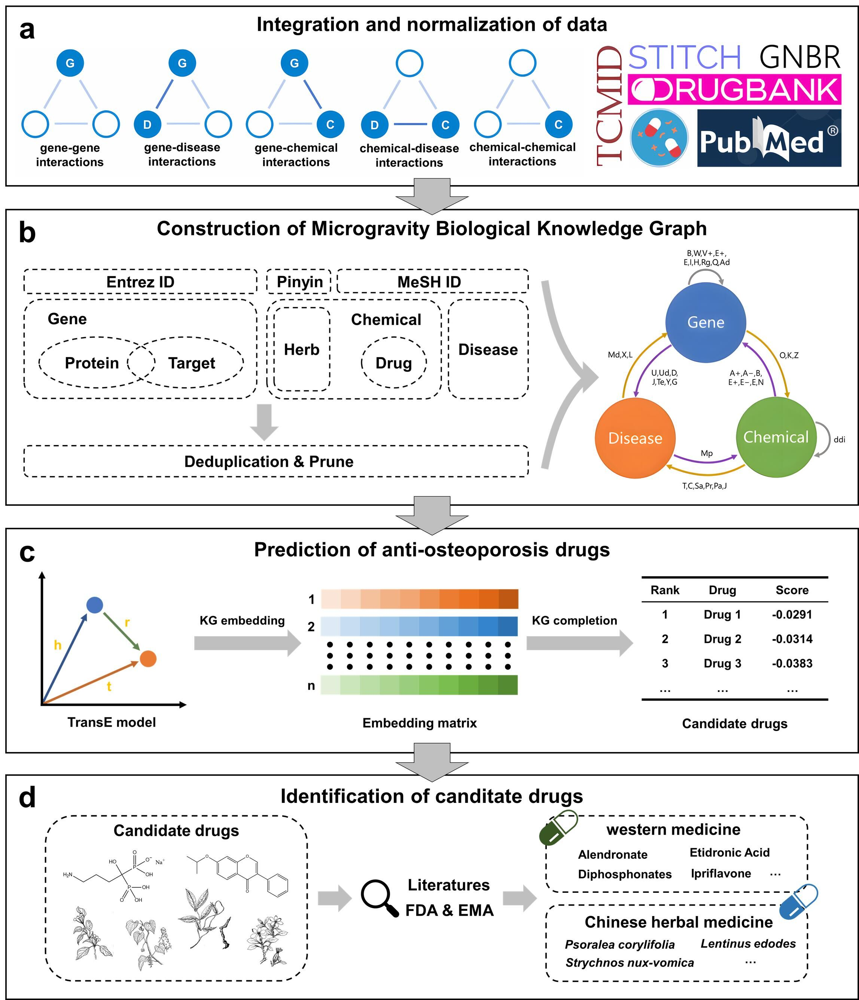

# Microgravity Biological Knowledge Graph (MBKG)

Microgravity in the space environment can potentially have various negative effects on the human body, one of which is bone loss. Given the increasing frequency of human space activities, there is an urgent need to identify effective anti-osteoporosis drugs for the microgravity environment. Traditional microgravity experiments conducted in space suffer from limitations such as time-consuming procedures, high costs, and small sample sizes. In recent years, the in-silico drug discovery method has emerged as a promising strategy due to the advancements in bioinformatics and computer technology. In this study, we first collected a total of 184,915 literature articles related to microgravity and bone loss. We employed a combination of dependency path extraction and clustering techniques to extract data from the text. Afterwards, we conducted data cleaning and standardization to integrate data from several sources, including The Global Network of Biomedical Relationships (GNBR), Curated Drug-Drug Interactions Database (DDInter), Search Tool for Interacting Chemicals (STITCH), DrugBank, and Traditional Chinese Medicines Integrated Database (TCMID). Through this integration process, we constructed the Microgravity Biology Knowledge Graph (MBKG) consisting of 134,796 biological entities and 3,395,273 triplets. Subsequently, the TransE model was utilized to perform knowledge graph embedding. By calculating the distances between entities in the model space, the model successfully predicted potential drugs for treating bone loss. The results indicate that out of the top 10 ranked western medicines, 7 have been approved for the treatment of osteoporosis. Additionally, among the top 10 ranked traditional Chinese medicines, 5 have scientific literature supporting their effectiveness in treating bone loss. This research highlights the potential application of MBKG in the field of space drug discovery.

<p align="center">
  
  <br>
  <b>Figure</b>: The overview of the MBKG framework.
</p>


## Statistics of MBKG
The table below shows the number of triplets corresponding to different entity pair types in MBKG from various data sources.

| Entity pair types  | Text Mining & GNBR | DDInter | STITCH | DrugBank | TCMID | Total interactions |
|:-----------------------|-----------:|-------:|---------:|--------:|-------:|-------------------:|
| \(Gene, Gene\)                    | 1,263,565 | \- | \- | \- | \- | 1,263,565  |
| \(Gene, Disease\)      | 775,705 | \- |      \- | \-      |     \- | 775,705     |
| \(Chemical, Gene\)         | 334,073 | \- | 345,134 | 7,264 | \-     | 686,471       |
| \(Chemical, Disease\)   | 597,540 | \-     | \-       | \-      | 21,227 | 618,767        |
| \(Chemical, Chemical\) | \-   | 50,765 | \-   | \-      | \-     | 50,765      |
| Total                                 | 2,970,883 | 50,765 | 345,134 |    7,264 | 21,227 | 3,395,273   |

## MBKG embedding

DGL-KE is a knowledge graph embedding library, supports multiple knowledge graph embedding models, including TransE, DistMult, ComplEx, and provides functionality for training and evaluating these models. The MBKG embeddings is trained using the TransE_l2 model in DGL-KE, with an embedding dimension of 400. The specific training command for this project is as follows：

~~~
!DGLBACKEND=pytorch dglke_train --dataset MGKG --data_path ./Train --data_files mgkg_train.csv mgkg_valid.csv mgkg_test.csv --format 'raw_udd_hrt' --model_name TransE_l2 --batch_size 2048 --neg_sample_size 256 --hidden_dim 400 --gamma 12.0 --lr 0.1 --max_step 100000 --log_interval 1000 --batch_size_eval 16 -adv --regularization_coef 1.00E-07 --test --num_thread 1 --gpu 0 --neg_sample_size_eval 10000
~~~

After training, four files will be generated:

* DRKG\_TransE\_l2\_entity.npy: NumPy binary data, storing the entity embedding

* DRKG\_TransE\_l2\_relation.npy: NumPy binary data, storing the relation embedding

* entities.tsv: mapping from entity\_name to entity\_id

* relations.tsv: mapping from relation\_name to relation\_id

The pretrained embeddings can be quickly utilized using the Numpy library:

~~~python
import numpy as np
entity_emb = np.load('./embed/DRKG_TransE_l2_entity.npy')
rel_emb = np.load('./embed/DRKG_TransE_l2_relation.npy')
~~~

DGL-KE can be installed using the following command. For more details, please see [DGL-KE documentation](https://dglke.dgl.ai/doc/install.html).

### PyTorch

This project utilizes PyTorch as the backend for deep learning. Alternative versions of PyTorch can be downloaded from [here](https://pytorch.org/).

~~~
sudo pip3 install torch==1.5.0+cu101 torchvision==0.6.0+cu101 -f https://download.pytorch.org/whl/torch_stable.html
~~~

### DGL

DGL-KE is built on top of Deep Graph Library (DGL==0.4.3). You can install DGL using pip:

~~~
sudo pip3 install dgl==0.4.3
~~~

or use the following command to install DGL with CUDA support:

~~~
sudo pip3 install dgl-cu101
~~~

### DGL-KE

 The fastest way to install DGL-KE is by using pip:

~~~
sudo pip3 install dglke
~~~

## Prediction of anti-osteoporosis drugs

In this project, we utilized pre-trained MBKG to predict the efficacy of anti-osteoporosis western medicine and traditional Chinese medicine. [Bone_loss_drug_repurposing.ipynb](./code/Predict/Bone_loss_drug_repurposing.ipynb) provides the details. There are two result files:

* modern_medicine.csv: The top 100 predicted anti-osteoporosis western medicine

* traditional_Chinese_medicine.csv:  100 predicted anti-osteoporosis traditional Chinese medicine

## Data availability

The text data can be obtained through the code workflow and the datasets used here can be downloaded from their respective database official websites.

## Cite

Please cite our dataset if you use this code and data in your work.

```
@misc{mbkg2023,
  author = {Yu-Han Zheng, Guan-Jing Pan, Yuan Quan & Hong-Yu Zhang},
  title = {Construction of microgravity biological knowledge graph and its applications in anti-osteoporosis drug prediction},
  howpublished = "\url{https://github.com/g1g122/mbkg/}",
  year = {2023}
}
```
